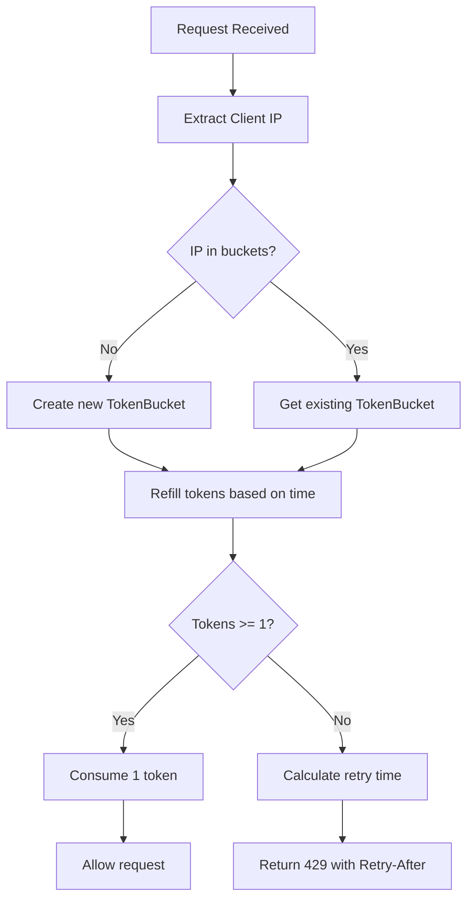

# Rate Limiting Middleware Design

## Overview

Implement a rate limiting middleware using the token bucket algorithm with in-memory storage to limit requests per IP address per minute. The middleware will return HTTP 429 (Too Many Requests) with appropriate headers when the limit is exceeded.

## Requirements

- Token bucket algorithm for rate limiting
- In-memory storage (no external dependencies)
- Configurable requests per minute per IP
- Return 429 status with Retry-After header
- Integrate seamlessly after LoggingMiddleware
- Follow clean code principles and project structure

## Data Structures

### TokenBucket

```go
type TokenBucket struct {
    tokens     float64    // Current number of tokens
    lastRefill time.Time  // Last time tokens were refilled
    capacity   int        // Maximum tokens (requests per minute)
}
```

### RateLimiter

```go
type RateLimiter struct {
    buckets            map[string]*TokenBucket // IP -> TokenBucket
    mu                 sync.RWMutex           // Thread safety
    requestsPerMinute  int                    // Configurable limit
}
```

## Configuration Options

### RateLimitConfig

Add to `config.go`:

```go
type RateLimitConfig struct {
    RequestsPerMinute int // Default: 60
}
```

Environment variable: `RATE_LIMIT_REQUESTS_PER_MINUTE=60`

## Algorithm Details

### Token Refill Logic

- Refill rate: `capacity` tokens per minute
- Tokens added: `(time.Since(lastRefill).Minutes()) * capacity`
- Tokens capped at `capacity`
- Tokens consumed: 1 per request

### Rate Limiting Flow



## Integration Points

### Middleware Stack Order

Current stack in `main.go`:

```go
r.Use(middleware.LoggingMiddleware)
r.Use(middleware.RateLimitMiddleware(cfg.RateLimit))  // NEW: After LoggingMiddleware
r.Use(middleware.CORSMiddleware(cfg.CORS))
r.Use(middleware.ValidationMiddleware)
r.Use(middleware.ErrorHandler)
```

### IP Extraction

- Use `r.RemoteAddr` for client IP
- Consider `X-Forwarded-For` header if behind proxy (future enhancement)

### Headers for 429 Response

- `Retry-After`: Seconds until next token available
- `X-RateLimit-Limit`: Requests per minute
- `X-RateLimit-Remaining`: Remaining tokens (approximate)
- `X-RateLimit-Reset`: Unix timestamp when bucket resets

## Implementation Files

### backend/internal/middleware/rate_limit.go

- `RateLimitMiddleware(config RateLimitConfig) func(http.Handler) http.Handler`
- `NewRateLimiter(requestsPerMinute int) *RateLimiter`
- Methods: `Allow(ip string) (bool, time.Duration)`

### backend/internal/middleware/rate_limit_test.go

- Unit tests for token bucket logic
- Integration tests for middleware
- Test cases: normal requests, rate limited, burst allowance, time-based refill

### backend/internal/config/config.go

- Add `RateLimit RateLimitConfig` to Config struct
- Update `LoadConfig()` to parse `RATE_LIMIT_REQUESTS_PER_MINUTE`

### backend/cmd/server/main.go

- Add rate limiting middleware to router

## Clean Code Principles

- Single Responsibility: Separate rate limiter logic from HTTP handling
- Thread Safety: Use RWMutex for concurrent access
- Configurability: Environment-based configuration
- Error Handling: Graceful degradation, no panics
- Testing: Comprehensive unit and integration tests

## Performance Considerations

- In-memory map is fast for typical loads
- RWMutex allows concurrent reads
- Minimal memory footprint per IP
- Automatic cleanup of inactive IPs (future enhancement)

## Future Enhancements

- Distributed rate limiting (Redis)
- Per-endpoint limits
- User-based limiting (with auth)
- Metrics and monitoring
- IP cleanup for memory management
