# Database

This section describes the **database layer** of the Tag Management System — its schema design, initialization scripts, and supporting utilities. It serves as the authoritative reference for how all relational data is stored, linked, and maintained within PostgreSQL.

## Overview

The database consists of several key areas:

- **[Database Schema](./schema/index.md)** — defines the logical data model for the Tag Management System, outlining all core tables, relationships, and dependencies.
	- **[Entities](./schema/01-entities/index.md)** — contains tables that represent the fundamental data objects managed by the system, such as digital assets, documents, or external resources.
	- **[Tags](./schema/02-tags/index.md)** — defines how tags are created, organized, and linked, including hierarchical, associative, and compositional relationships between tags.
	- **[Entity Tagging](./schema/03-entity_tagging.md)** — manages the mapping of tags to entities, enabling context-aware classification, grouping, and metadata enrichment.
	- **[User Interface (UI) Configurations](./schema/04-ui_configurations/index.md)** — defines how tagging and entity data are visually grouped, sorted, and rendered in the user interface.
	- **[Utilities](./schema/05-miscellaneous/index.md)** — auxiliary reference tables that support schema integrity, classification, and operational consistency.
		- **[Parts of Speech](./schema/05-miscellaneous/01-parts_of_speech.md)** — enumerates linguistic categories (e.g., nouns, verbs, adjectives) for grammatical tagging and semantic interpretation.
		- **[Ratings](./schema/05-miscellaneous/02-ratings.md)** — defines rating scales and scoring systems used to evaluate tags, tag relationships, or contextual relevance.
		- **[Versioning](./schema/05-miscellaneous/03-versioning.md)** — defines how entities are versioned using directional relationships, where a primary entity links to its alternate or derived versions. This structure ensures consistent tracking of revisions and related files across the system.
- **[Schema Constraints](./schema/06-schema_constraints/index.md)** — enforces referential integrity, uniqueness, and logical consistency across all schema components using foreign keys, check constraints, and triggers.
- **[Database Scripts](./scripts/index.md)** — provides executable SQL scripts to initialize, rebuild, or migrate the database, ensuring a consistent environment setup across development and production.

## Design Notes

- **Primary Key Strategy:** All tables use `UUIDv4` primary keys generated by the PostgreSQL `uuid-ossp` extension.  
- **Audit Fields:** Every table includes `created_at`, `updated_at`, `created_by`, and `updated_by` columns. These are maintained automatically via database triggers or by the application service layer.  
- **Foreign Keys:** Unless otherwise specified, all foreign keys reference UUID primary keys.

## Common Trigger Function

The following function can be applied to all tables to automatically maintain audit timestamps:

```sql
CREATE OR REPLACE FUNCTION set_audit_fields()
RETURNS TRIGGER AS $$
BEGIN
  NEW.updated_at = CURRENT_TIMESTAMP;
  RETURN NEW;
END;
$$ LANGUAGE plpgsql;
```

Attach this function to each table using a BEFORE UPDATE trigger to ensure consistent updated_at management across the schema.

## Entity-Relationship (ER) Diagram

A complete diagram of all entities, tags, and relationships is available below for visual reference.

```mermaid
erDiagram

  %% === CORE ENTITIES ===
  ENTITIES {
    UUID id PK
    TEXT name
    TEXT location
    BOOLEAN is_primary
    JSONB metadata
  }

  TAGS {
    UUID id PK
    TEXT name
    TEXT display_name
    JSONB metadata
    UUID part_of_speech_id FK
  }

  PARTS_OF_SPEECH {
    UUID id PK
    TEXT name
    TEXT description
    BOOLEAN is_active
  }

  ENTITY_TAGS {
    UUID id PK
    UUID entity_id FK
    UUID tag_id FK
    UUID context_id FK
    JSONB metadata
  }

  CONTEXTS {
    UUID id PK
    TEXT name
    TEXT classification_type
    TEXT description
    BOOLEAN is_active
  }

  %% === TAGGING STRUCTURE ===
  TAG_ALIASES {
    UUID id PK
    TEXT name
    UUID tag_id FK
  }

  TAG_RELATIONSHIPS {
    UUID id PK
    UUID tag_a_id FK
    UUID tag_b_id FK
    UUID relationship_type_id FK
    TEXT description
  }

  TAG_RELATIONSHIP_TYPES {
    UUID id PK
    TEXT name
  }

  TAG_COMPOSITIONS {
    UUID id PK
    UUID base_tag_id FK
    UUID component_tag_id FK
    INT position
  }

  %% === ENTITY RELATIONSHIPS ===
  ENTITY_RELATIONSHIPS {
    UUID id PK
    UUID entity_a_id FK
    UUID entity_b_id FK
    UUID relationship_type_id FK
  }

  ENTITY_RELATIONSHIP_TYPES {
    UUID id PK
    TEXT name
  }

  %% === ENTITY PURPOSES ===
  ENTITY_PURPOSES {
    UUID id PK
    UUID entity_id FK
    UUID purpose_tag_id FK
    BOOLEAN is_primary
  }

  %% === UI CONFIGURATION ===
  UI_LAYOUTS {
    UUID id PK
    UUID purpose_tag_id FK
    TEXT name
  }

  UI_GROUPS {
    UUID id PK
    TEXT name
  }

  UI_FIELDS {
    UUID id PK
    UUID ui_layout_id FK
    UUID ui_group_id FK
    UUID context_id FK
    UUID category_tag_id FK
    INT sort_order
  }

  %% === RATINGS ===
  RATINGS {
    UUID id PK
    TEXT name
    INT score
    TEXT description
    UUID rating_type_id FK
  }

  RATING_TYPES {
    UUID id PK
    TEXT name
    BOOLEAN is_normalized
  }

  TAG_CONTEXT_RATINGS {
    UUID id PK
    UUID tag_id FK
    UUID context_id FK
    UUID rating_id FK
    UUID user_id FK
  }

  TAG_RELATIONSHIP_RATINGS {
    UUID id PK
    UUID tag_a_id FK
    UUID tag_b_id FK
    UUID context_id FK
    UUID rating_id FK
  }

  %% === RELATIONSHIPS ===

  ENTITIES ||--o{ ENTITY_TAGS : tags
  TAGS ||--o{ ENTITY_TAGS : entities
  CONTEXTS ||--o{ ENTITY_TAGS : context

  TAGS ||--o{ TAG_ALIASES : aliases
  TAGS ||--o{ TAG_RELATIONSHIPS : tag_a
  TAGS ||--o{ TAG_RELATIONSHIPS : tag_b
  TAG_RELATIONSHIP_TYPES ||--o{ TAG_RELATIONSHIPS : type

  TAGS ||--o{ TAG_COMPOSITIONS : base
  TAGS ||--o{ TAG_COMPOSITIONS : component

  ENTITIES ||--o{ ENTITY_PURPOSES : purposes
  TAGS ||--o{ ENTITY_PURPOSES : purpose_tag

  ENTITIES ||--o{ ENTITY_RELATIONSHIPS : source
  ENTITIES ||--o{ ENTITY_RELATIONSHIPS : derived
  ENTITY_RELATIONSHIP_TYPES ||--o{ ENTITY_RELATIONSHIPS : type

  PARTS_OF_SPEECH ||--o{ TAGS : pos

  UI_LAYOUTS ||--o{ UI_FIELDS : layout
  UI_GROUPS ||--o{ UI_FIELDS : group
  CONTEXTS ||--o{ UI_FIELDS : context
  TAGS ||--o{ UI_FIELDS : category

  TAGS ||--o{ TAG_CONTEXT_RATINGS : rated
  CONTEXTS ||--o{ TAG_CONTEXT_RATINGS : in_context
  RATINGS ||--o{ TAG_CONTEXT_RATINGS : rating

  TAGS ||--o{ TAG_RELATIONSHIP_RATINGS : rated_a
  TAGS ||--o{ TAG_RELATIONSHIP_RATINGS : rated_b
  CONTEXTS ||--o{ TAG_RELATIONSHIP_RATINGS : in_context
  RATINGS ||--o{ TAG_RELATIONSHIP_RATINGS : rating
```


