# Database

This section describes the **database layer** of the Tag Management System — its schema design, initialization scripts, and supporting utilities. It serves as the authoritative reference for how all relational data is stored, linked, and maintained within PostgreSQL.

## Overview

The database consists of several key areas:

- **[Database Schema](./schema/index.md)** — defines the logical data model for the Tag Management System, outlining all core tables, relationships, and dependencies.
	- **[Entities](./schema/01-entities/index.md)** — contains tables that represent the fundamental data objects managed by the system, such as digital assets, documents, or external resources.
	- **[Tags](./schema/02-tags/index.md)** — defines how tags are created, organized, and linked, including hierarchical, associative, and compositional relationships between tags.
	- **[Entity Tagging](./schema/03-entity_tagging.md)** — manages the mapping of tags to entities, enabling context-aware classification, grouping, and metadata enrichment.
	- **[User Interface (UI) Configurations](./schema/04-ui_configurations/index.md)** — defines how tagging and entity data are visually grouped, sorted, and rendered in the user interface.
	- **[Utilities](./schema/05-miscellaneous/index.md)** — auxiliary reference tables that support schema integrity, classification, and operational consistency.
		- **[Parts of Speech](./schema/05-miscellaneous/01-parts_of_speech.md)** — enumerates linguistic categories (e.g., nouns, verbs, adjectives) for grammatical tagging and semantic interpretation.
		- **[Ratings](./schema/05-miscellaneous/02-ratings.md)** — defines rating scales and scoring systems used to evaluate tags, tag relationships, or contextual relevance.
- **[Schema Constraints](./schema/06-schema_constraints/index.md)** — enforces referential integrity, uniqueness, and logical consistency across all schema components using foreign keys, check constraints, and triggers.
- **[Database Scripts](./scripts/index.md)** — provides executable SQL scripts to initialize, rebuild, or migrate the database, ensuring a consistent environment setup across development and production.

## Design Notes

- **Primary Keys:** All tables use `UUIDv4` primary keys generated by the PostgreSQL `uuid-ossp` extension.  
- **Audit Fields:** Each table includes `created_at`, `updated_at`, `created_by`, and `updated_by`. These are maintained automatically by triggers or the application service layer.  
- **Foreign Keys:** Unless otherwise specified, all relationships reference UUID primary keys.  
- **Versioning:** Version lineage is expressed through directed relationships between entities or tags (e.g., `entity_relationships` or `tag_relationships`), rather than a dedicated versioning table.

## Common Trigger Function

This function maintains audit timestamps (created_at, updated_at) across all tables. It should be defined once and applied to every table via BEFORE UPDATE triggers.

```sql
CREATE OR REPLACE FUNCTION update_timestamp()
RETURNS TRIGGER AS $$
BEGIN
  NEW.updated_at = NOW();
  RETURN NEW;
END;
$$ LANGUAGE plpgsql;
```

With example use:

```sql
CREATE TRIGGER trg_update_timestamp
BEFORE UPDATE ON tags
FOR EACH ROW
EXECUTE FUNCTION update_timestamp();

CREATE TRIGGER trg_update_timestamp
BEFORE UPDATE ON entities
FOR EACH ROW
EXECUTE FUNCTION update_timestamp();
```

Attach this function to each table using a BEFORE UPDATE trigger to ensure consistent updated_at management across the schema.

If you also want to automatically populate created_at on insert:

```sql
CREATE OR REPLACE FUNCTION set_created_timestamp()
RETURNS TRIGGER AS $$
BEGIN
  IF NEW.created_at IS NULL THEN
    NEW.created_at = NOW();
  END IF;
  RETURN NEW;
END;
$$ LANGUAGE plpgsql;

CREATE TRIGGER trg_set_created_timestamp
BEFORE INSERT ON tags
FOR EACH ROW
EXECUTE FUNCTION set_created_timestamp();
```

## Entity-Relationship (ER) Diagram

A complete diagram of all entities, tags, and relationships is available below for visual reference.

```mermaid
erDiagram

  %% =========================
  %% CORE TABLES
  %% =========================

  ENTITIES {
    UUID id PK
    TEXT name
    TEXT location
    BOOLEAN is_primary
    JSONB metadata
  }

  TAGS {
    UUID id PK
    TEXT name
    TEXT display_name
    JSONB metadata
    UUID part_of_speech_id FK
  }

  ENTITY_TAGS {
    UUID id PK
    UUID entity_id FK
    UUID tag_id FK
    UUID context_id FK
    JSONB metadata
  }

  %% =========================
  %% ENTITY SUBSYSTEM
  %% =========================

  ENTITY_PURPOSES {
    UUID id PK
    UUID entity_id FK
    UUID purpose_tag_id FK
    BOOLEAN is_primary
  }

  ENTITY_RELATIONSHIPS {
    UUID id PK
    UUID entity_a_id FK
    UUID entity_b_id FK
    UUID relationship_type_id FK
  }

  ENTITY_RELATIONSHIP_RATINGS {
    UUID id PK
    UUID entity_a_id FK
    UUID entity_b_id FK
    UUID context_id FK
    UUID rating_id FK
  }

  %% =========================
  %% TAG SUBSYSTEM
  %% =========================

  TAG_ALIASES {
    UUID id PK
    TEXT name
    UUID tag_id FK
  }

  TAG_RELATIONSHIPS {
    UUID id PK
    UUID tag_a_id FK
    UUID tag_b_id FK
    UUID relationship_type_id FK
    TEXT description
  }

  TAG_COMPOSITIONS {
    UUID id PK
    UUID base_tag_id FK
    UUID component_tag_id FK
    INT position
  }

  TAG_CONTEXT_RATINGS {
    UUID id PK
    UUID tag_id FK
    UUID context_id FK
    UUID rating_id FK
    UUID user_id FK
  }

  TAG_RELATIONSHIP_RATINGS {
    UUID id PK
    UUID tag_a_id FK
    UUID tag_b_id FK
    UUID context_id FK
    UUID rating_id FK
  }

  TAG_RELATIONSHIP_TYPES {
    UUID id PK
    TEXT name
  }

  %% =========================
  %% UTILITIES
  %% =========================

  CONTEXTS {
    UUID id PK
    TEXT name
    TEXT classification_type
    TEXT description
    BOOLEAN is_active
  }

  PARTS_OF_SPEECH {
    UUID id PK
    TEXT name
    TEXT description
    BOOLEAN is_active
  }

  RATINGS {
    UUID id PK
    TEXT name
    INT score
    TEXT description
    UUID rating_type_id FK
  }

  RATING_TYPES {
    UUID id PK
    TEXT name
    BOOLEAN is_normalized
  }

  %% =========================
  %% UI CONFIGURATION
  %% =========================

  UI_LAYOUTS {
    UUID id PK
    UUID purpose_tag_id FK
    TEXT name
  }

  UI_GROUPS {
    UUID id PK
    TEXT name
  }

  UI_FIELDS {
    UUID id PK
    UUID ui_layout_id FK
    UUID ui_group_id FK
    UUID context_id FK
    UUID category_tag_id FK
    INT sort_order
  }

  %% =========================
  %% RELATIONSHIPS
  %% =========================

  ENTITIES ||--o{ ENTITY_TAGS : has
  TAGS ||--o{ ENTITY_TAGS : used_in

  ENTITIES ||--o{ ENTITY_PURPOSES : has
  TAGS ||--o{ ENTITY_PURPOSES : defines

  ENTITIES ||--o{ ENTITY_RELATIONSHIPS : source
  ENTITIES ||--o{ ENTITY_RELATIONSHIPS : target
  ENTITY_RELATIONSHIPS ||--o{ ENTITY_RELATIONSHIP_RATINGS : rated_by
  RATINGS ||--o{ ENTITY_RELATIONSHIP_RATINGS : value
  CONTEXTS ||--o{ ENTITY_RELATIONSHIP_RATINGS : context

  TAGS ||--o{ TAG_ALIASES : has
  TAGS ||--o{ TAG_RELATIONSHIPS : tag_a
  TAGS ||--o{ TAG_RELATIONSHIPS : tag_b
  TAG_RELATIONSHIPS ||--o{ TAG_RELATIONSHIP_RATINGS : rated_by
  CONTEXTS ||--o{ TAG_RELATIONSHIP_RATINGS : context
  RATINGS ||--o{ TAG_RELATIONSHIP_RATINGS : value

  TAGS ||--o{ TAG_COMPOSITIONS : base
  TAGS ||--o{ TAG_COMPOSITIONS : component

  TAGS ||--o{ TAG_CONTEXT_RATINGS : rated_in
  CONTEXTS ||--o{ TAG_CONTEXT_RATINGS : context
  RATINGS ||--o{ TAG_CONTEXT_RATINGS : value

  TAGS ||--o{ UI_LAYOUTS : defines_purpose
  TAGS ||--o{ UI_FIELDS : category
  CONTEXTS ||--o{ UI_FIELDS : context
  UI_LAYOUTS ||--o{ UI_FIELDS : contains
  UI_GROUPS ||--o{ UI_FIELDS : grouped_under
```


