# Database Reference

This section details the database schema used by the Tagging Service.

- [Entities](entities.md)
- [Tags](./tags.md)
- [Entity Tagging](./entity_tagging.md)
- Utilities
	- [User Interface (UI) Configurations](./utilities/ui_configurations.md)
	- [Ratings](./utilities/ratings.md)
	- [Parts of Speech](./utilities/parts_of_speech.md)
- [Database Schema](./schema/schema.md)
	- [Schema Enforcement](./schema/schema_enforcement.md)

> **Notes**: All foreign keys in this schema refer to UUID primary keys unless otherwise noted.

> **Note:** Every table in the system includes audit columns: `created_at`, `updated_at` (both of type `TIMESTAMP`), and `created_by`, `updated_by` to track when records are created and last modified. These fields are maintained automatically by the service layer or database triggers.

Use a trigger-based approach and apply to all tables with a common function:

```sql
CREATE OR REPLACE FUNCTION set_audit_fields()
RETURNS TRIGGER AS $$
BEGIN
  NEW.updated_at = CURRENT_TIMESTAMP;
  RETURN NEW;
END;
$$ LANGUAGE plpgsql;
```

## Entity-Relationship (ER) diagram

```mermaid
erDiagram

  %% === CORE ENTITIES ===
  ENTITIES {
    UUID id PK
    TEXT name
    TEXT location
    BOOLEAN is_primary
    JSONB metadata
  }

  TAGS {
    UUID id PK
    TEXT name
    TEXT display_name
    JSONB metadata
    UUID part_of_speech_id FK
  }

  PARTS_OF_SPEECH {
    UUID id PK
    TEXT name
    TEXT description
    BOOLEAN is_active
  }

  ENTITY_TAGS {
    UUID id PK
    UUID entity_id FK
    UUID tag_id FK
    UUID context_id FK
    JSONB metadata
  }

  CONTEXTS {
    UUID id PK
    TEXT name
    TEXT classification_type
    TEXT description
    BOOLEAN is_active
  }

  %% === TAGGING STRUCTURE ===
  TAG_ALIASES {
    UUID id PK
    TEXT name
    UUID tag_id FK
  }

  TAG_RELATIONSHIPS {
    UUID id PK
    UUID tag_a_id FK
    UUID tag_b_id FK
    UUID relationship_type_id FK
    TEXT description
  }

  TAG_RELATIONSHIP_TYPES {
    UUID id PK
    TEXT name
  }

  TAG_COMPOSITIONS {
    UUID id PK
    UUID base_tag_id FK
    UUID component_tag_id FK
    INT position
  }

  %% === ENTITY RELATIONSHIPS ===
  ENTITY_RELATIONSHIPS {
    UUID id PK
    UUID entity_a_id FK
    UUID entity_b_id FK
    UUID relationship_type_id FK
  }

  ENTITY_RELATIONSHIP_TYPES {
    UUID id PK
    TEXT name
  }

  %% === ENTITY PURPOSES ===
  ENTITY_PURPOSES {
    UUID id PK
    UUID entity_id FK
    UUID purpose_tag_id FK
    BOOLEAN is_primary
  }

  %% === UI CONFIGURATION ===
  UI_LAYOUTS {
    UUID id PK
    UUID purpose_tag_id FK
    TEXT name
  }

  UI_GROUPS {
    UUID id PK
    TEXT name
  }

  UI_FIELDS {
    UUID id PK
    UUID ui_layout_id FK
    UUID ui_group_id FK
    UUID context_id FK
    UUID category_tag_id FK
    INT sort_order
  }

  %% === RATINGS ===
  RATINGS {
    UUID id PK
    TEXT name
    INT score
    TEXT description
    UUID rating_type_id FK
  }

  RATING_TYPES {
    UUID id PK
    TEXT name
    BOOLEAN is_normalized
  }

  TAG_CONTEXT_RATINGS {
    UUID id PK
    UUID tag_id FK
    UUID context_id FK
    UUID rating_id FK
    UUID user_id FK
  }

  TAG_RELATIONSHIP_RATINGS {
    UUID id PK
    UUID tag_a_id FK
    UUID tag_b_id FK
    UUID context_id FK
    UUID rating_id FK
  }

  %% === RELATIONSHIPS ===

  ENTITIES ||--o{ ENTITY_TAGS : tags
  TAGS ||--o{ ENTITY_TAGS : entities
  CONTEXTS ||--o{ ENTITY_TAGS : context

  TAGS ||--o{ TAG_ALIASES : aliases
  TAGS ||--o{ TAG_RELATIONSHIPS : tag_a
  TAGS ||--o{ TAG_RELATIONSHIPS : tag_b
  TAG_RELATIONSHIP_TYPES ||--o{ TAG_RELATIONSHIPS : type

  TAGS ||--o{ TAG_COMPOSITIONS : base
  TAGS ||--o{ TAG_COMPOSITIONS : component

  ENTITIES ||--o{ ENTITY_PURPOSES : purposes
  TAGS ||--o{ ENTITY_PURPOSES : purpose_tag

  ENTITIES ||--o{ ENTITY_RELATIONSHIPS : source
  ENTITIES ||--o{ ENTITY_RELATIONSHIPS : derived
  ENTITY_RELATIONSHIP_TYPES ||--o{ ENTITY_RELATIONSHIPS : type

  PARTS_OF_SPEECH ||--o{ TAGS : pos

  UI_LAYOUTS ||--o{ UI_FIELDS : layout
  UI_GROUPS ||--o{ UI_FIELDS : group
  CONTEXTS ||--o{ UI_FIELDS : context
  TAGS ||--o{ UI_FIELDS : category

  TAGS ||--o{ TAG_CONTEXT_RATINGS : rated
  CONTEXTS ||--o{ TAG_CONTEXT_RATINGS : in_context
  RATINGS ||--o{ TAG_CONTEXT_RATINGS : rating

  TAGS ||--o{ TAG_RELATIONSHIP_RATINGS : rated_a
  TAGS ||--o{ TAG_RELATIONSHIP_RATINGS : rated_b
  CONTEXTS ||--o{ TAG_RELATIONSHIP_RATINGS : in_context
  RATINGS ||--o{ TAG_RELATIONSHIP_RATINGS : rating
```


